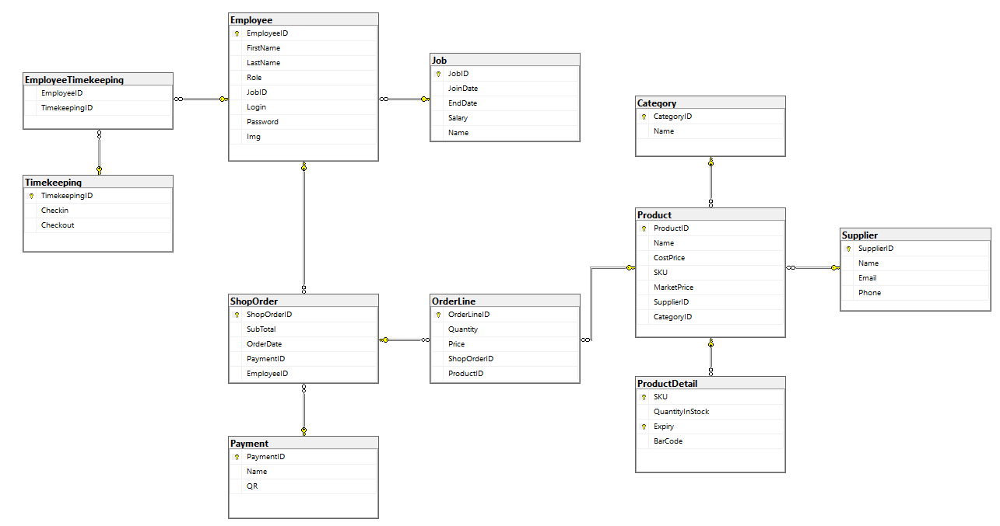
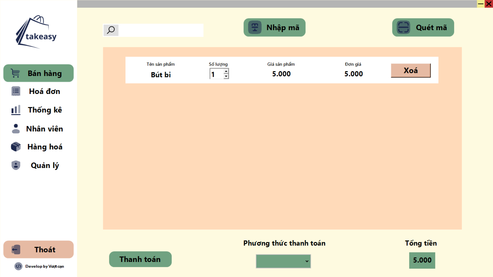
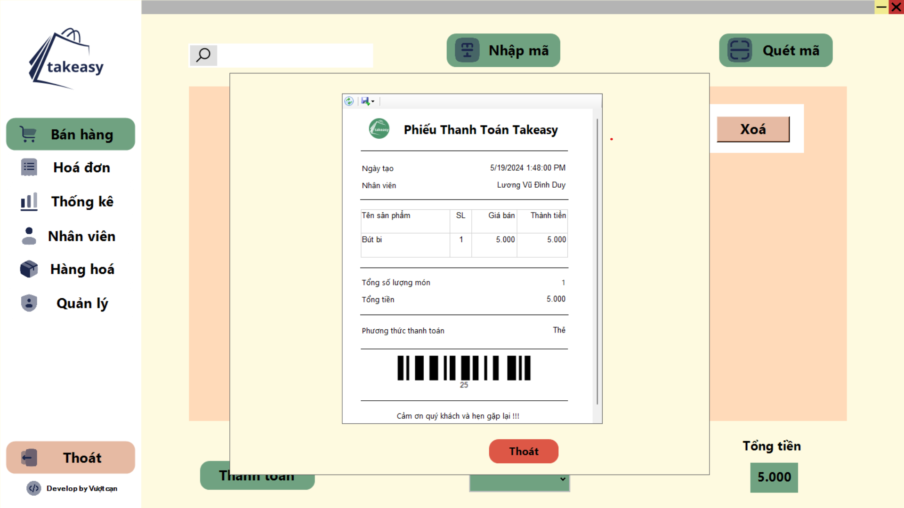
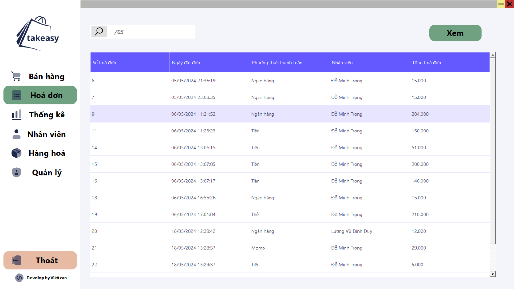
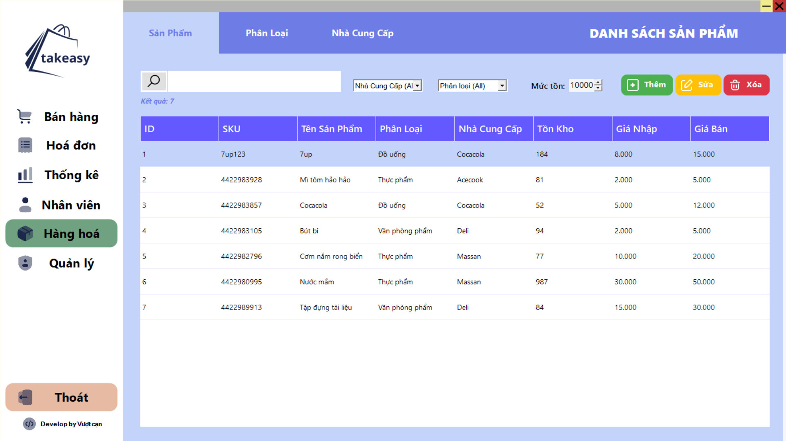
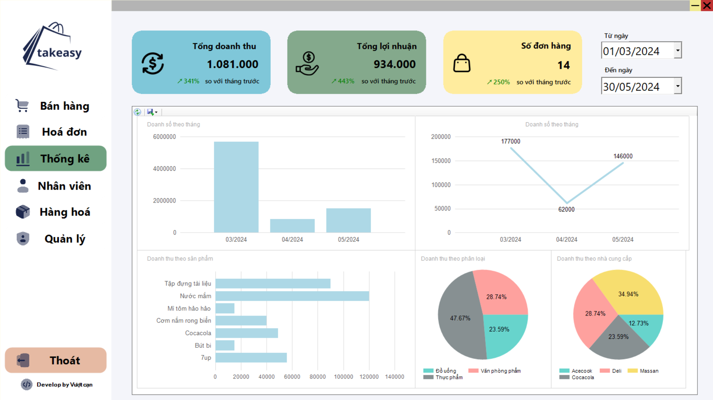
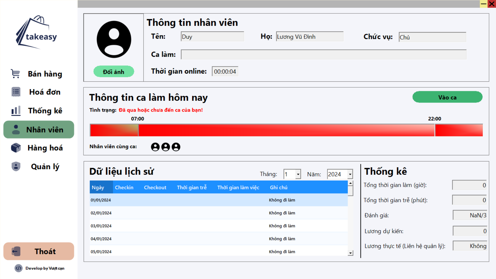
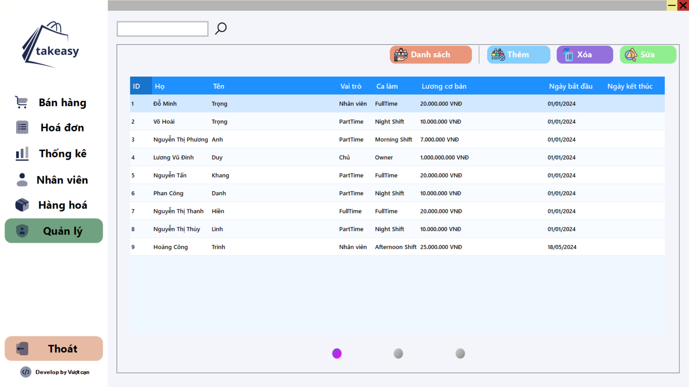
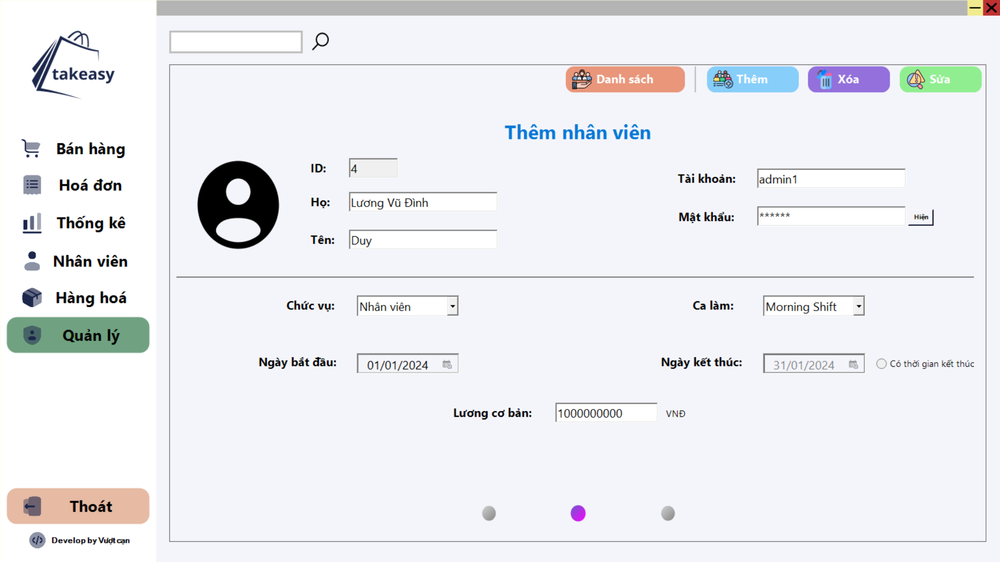

# Grocery store

Sales, merchandise and employee management application for small and medium grocery stores


## Badges

[](https://choosealicense.com/licenses/mit/)
[](https://www.microsoft.com/en-us/sql-server/sql-server-2019)
[](https%3A%2F%2Flearn.microsoft.com%2Fvi-vn%2Faspnet%2Fentity-framework)
[](https://dotnet.microsoft.com/en-us/download/dotnet-framework/net48)


## Data decription

The database includes basic tables to store information about goods, invoices, employees, timekeeping, suppliers and invoices.

### ERD
- [Detailed description of the database](/Database/Database.docx)



## Features

### Sell
- Add products to cart by entering code or scanning product code
- Select payment method
- Change and delete products in the cart
- Print invoice after successful payment

### Invoice
Review invoices as a list and detail each invoice

### Goods
Add, delete, and edit the following components:
- Supplier (email, name,..)
- Type of goods
- Product (name, stocks,...)
- Product details (quantity of goods along with expiration date according to each warehouse receipt)

### Staff
Depending on the employee's login, operations can be performed for each employee
- Timekeeping: You can observe shift start and shift delay times according to the time bar
- Check shifts for the month
- See the employees working the same shift
- See case summary

### Statistical
Based on the possible input time period:
- View revenue and sales statistics
- View this month's revenue and sales compared to last month
The graphs represent
- Revenue by product type and supplier
- Top best-selling products in the store

### Manage
With admin login it is possible
- Add, delete, and edit employees
- Change shifts, salaries and employee details

## Deployment

### Payment QR
Because the payment methods are being hard-installed and cannot be changed by the interface. There are 4 payment methods: Momo, Banking, Cash and card. If you want to change the QR code of momo and banking, follow the steps below

Add 2 images of momo and banking to the link:
```
  Image/banking.jpg
  Image/momo.jpg
```
Then run the program again and the payment image will be updated in your database

### Genarate BarCode
Because we create the product code based on the hash of the product's information (because you have to pay a fee to get the barcode of the product on the market). So after you add all the products to the database, to generate a barcode that can be scanned, do the following:

Edit the `Main()` function in `Program.cs`
```C#
static void Main()
{
  API.GenarateBarCode genarateBarCode = new API.GenarateBarCode();
  genarateBarCode.Genarate();
  //updatePayment();
  //Application.Run(new GUI.Login());
}
```
Then run the program, the product barcodes will be saved to the path `Image/barcode/`


## Screenshots


- Login: 
- Sell: 
- Invoice sell: 
- Invoice list: 
- Inventory: 
- Statistical: 
- Employee: 
- Admin: 



## Environment Variables

You must change the connection string to the database in GroceryStoreContext.cs in line 44

```C#
optionsBuilder.UseSqlServer("Server=<Server name>;Database=<Name of database>;Trusted_Connection=True;"); 
```


## Support

For support, email luongvudinhduy2003@gmail.com

